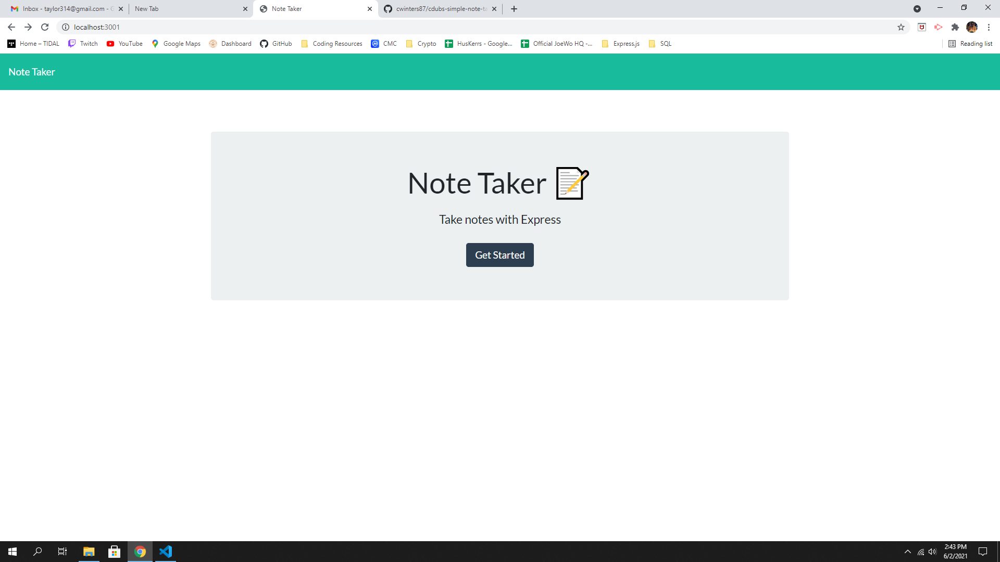
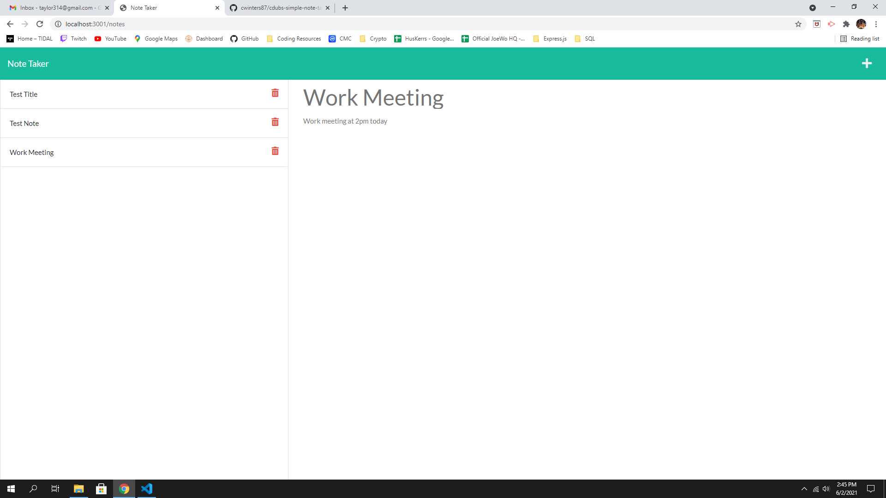

  <h1 align="center">Cdubs Simple Note Taker App!</h1>

## Description
A simple web page that saves and displays notes on a server.
## Table of Contents
- [Description](#description)
- [Installation](#installation)
- [Usage](#usage)
- [Demo](#demo)
- [Questions](#questions)
## Installation
💾 npm i
## Usage
💻 Helps saves notes and stores them on a server to easily bring them up anywhere you are.
## Demo

Here is the site it is deployed at:
https://cdubs-note-taker.herokuapp.com/

## Contributing
👪 Chris Winters
## Questions
🙋‍♂️ Email or reach me on my GitHub  
 
:octocat: Find me on GitHub: [cwinters87](https://github.com/cwinters87) 
 
✉️ Email me with any questions: taylor314@gmail.com  
🌟This README was generated by Chris Winters using the [readme-generator](https://github.com/cwinters87/readme-generator)
